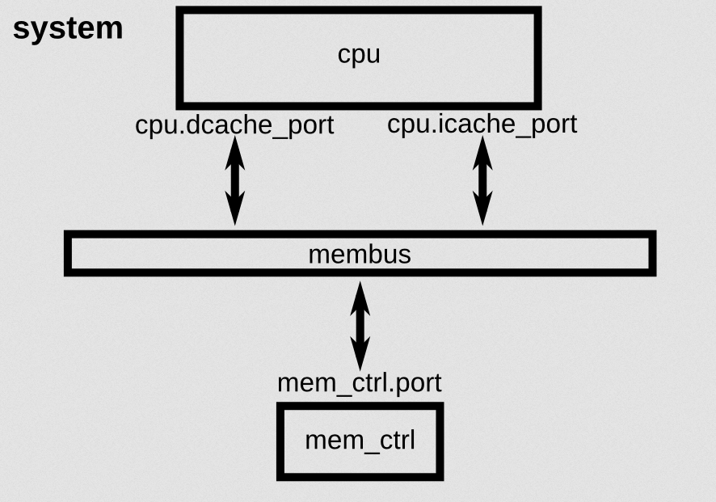
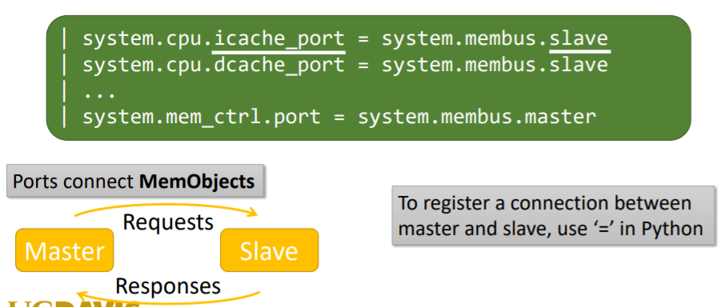
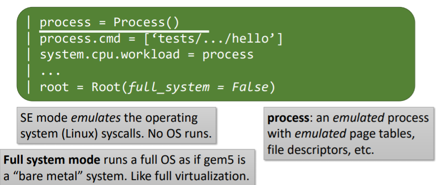

# Part1. System

我们的目标是构建一个system, 结构如图所示




## Step1

导入m5库以及所有的`SimObjects`

````python
import m5
from m5.objects import *
````

## Step2

创建System Object，这个会成为整个仿真系统其他所有objects的父对象

````python
system = System()
````

## Step3

设置clock。首先需要创建clock domain, 然后设置时钟频率。其次，我们需要设置该clock domain的voltage domain，这里我们只用voltage domain的默认设置

```python
system.clk_domain = SrcClockDomain()
system.clk_domain.clock = '1GHz'
system.clk_domain.voltage_domain = VoltageDomain()
```

## Step4

创建memory。将memory仿真的模式设为'timing'。设置memory的range为512MB

```python
system_mem_mode = 'timing'
system.mem_ranges = [AddrRange('512MB')]
```


## Step5

创建CPU

```python
system.cpu = TimingSimpleCPU()
```


## Step6

创建memory bus

```python
system.membus = SystemXBar()
```

将cache ports连接到memory bus上

```python
system.cpu.icache_port = system.membus.slave
system.cpu.dcache_port = system.membus.slave
```

为了保证系统的正常运作，我们还需要处理一下其他端口(这里暂时存疑，我没有搞懂)

```python
system.cpu.createInterruptController()
system.cpu.interrupts[0].pio = system.membus.master
system.cpu.interrupts[0].int_master = system.membus.slave
system.cpu.interrupts[0].int_slave = system.membus.master

system.system_port = system.membus.slave
```

#### Port Interface




## Step7

创建一个内存控制器，并将其连接到内存总线上

```python
system.mem_ctrl = DDR3_1600_8x8()
system.mem_ctrl.range = system.mem_ranges[0]
system.mem_ctrl.port = system.membus.master
```


到此为止，咱们的system创建完成


# Part2. Run Process

整体上我们在SE mode下跑一个简单的'hello world'程序

#### Syscall Emulation (SE) mode




## Step8

创建process

```python
process = Process()
process.cmd = ['tests/test-progs/hello/bin/x86/linux/hello']
system.cpu.workload = process
system.cpu.createThreads()
```

## Step9

初始化系统并且开始执行。

首先需要创建`Root`对象， 然后instantiate

```python
root = Root(full_system=Flase, system=system)
m5.instantiate()
```


## Step10

开始simulate

```python
print("Beginning simulation!")
exit_event = m5.simulate()
print('Exiting @ tick {} because {}'
     .format(m5.curTick(), exit_event.getCause()))
```


## 总体代码如下所示

```python
import m5
from m5.objects import *
# instantiate a system
# 'System' is a Python class wrapper for the System C++ SimObject

system = System()

# Initialize a clock and voltage domain
# 'clk_domain' is a *parameter* of the SimObject
system.clk_domain = SrcClockDomain()
system.clk_domain.clock = '1GHz'
# gem5 is start enough automatically convert units
system.clk_domain.voltage_domain = VoltageDomain()
# Let's set up the memory system
system.mem_mode = 'timing'
# You want to use *timing* for simulations, the options are things 'atomic' 'functional'(debug)

# All systems need memory!
system.mem_ranges = [AddrRange('512MB')]

# Let's create a CPU
system.cpu = TimingSimpleCPU()

# Now, we need a memory bus
system.membus = SystemXBar()

# Hook up CPU
system.cpu.icache_port = system.membus.slave
system.cpu.dcache_port = system.membus.slave

# Now, some BS to get things right
system.cpu.createInterruptController()
system.cpu.interrupts[0].pio = system.membus.master
system.cpu.interrupts[0].int_master = system.membus.slave
system.cpu.interrupts[0].int_slave = system.membus.master

system.system_port = system.membus.slave

# Finally, let's make the memory controller
system.mem_ctrl = DDR3_1600_8x8()

# Set up physical memory ranges
system.mem_ctrl.range = system.mem_ranges[0]

# Connect memory controller to bus
system.mem_ctrl.port = system.membus.master

# Now tell the system what we want it to do
# Build scons build/X86/gem5.opt -j5
process = Process()
process.cmd = ['tests/test-progs/hello/bin/x86/linux/hello']
system.cpu.workload = process
system.cpu.createThreads()

# Now, we're almost done!
# Create a root object
root = Root(full_system = False, system = system)

# Instantiate all of the C++
m5.instantiate()

# We're ready to run!
print("Beginning simulation!")
exit_event = m5.simulate()

print('Exiting @ tick {} because {}'
      .format(m5.curTick(), exit_event.getCause()))
```


## 运行

```shell
build/X86/gem5.opt configs/tutorial1/simple.py
```

运行结果如下所示


