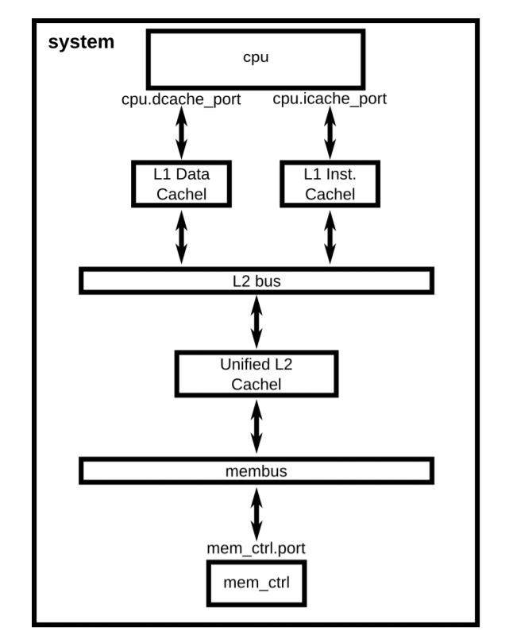
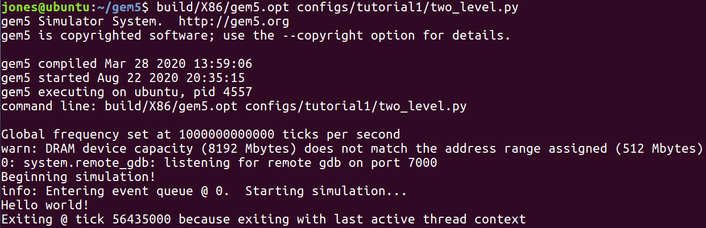

我们要将caches加入到之前创建的system中

整个系统的结果如下图所示





# Part1. Create Cache Class

## Step1

import  Cache rom SimObjects

```python
from m5.objects import Cache
```

## Step2

创建L1 Cache类

````python
class L1Cache(Cache):
    assoc = 2
    tag_latency = 2
    data_latency = 2
    response_latency = 2
    mshrs = 4
    tgts_per_mshr = 20
````

创建L1 cache的子类，instruction L1 cache, data L1 cache

```python
class L1ICache(L1Cache):
    size = '16kB'

class L1DCache(L1Cache):
    size = '64kB'
```

创建L2 cache类

```python
class L2Cache(Cache):
    size = '256kB'
    assoc = 8
    tag_latency = 20
    data_latency = 20
    mshrs = 20
    tgts_per_mshr = 12
```

## Step3

为cache增加函数

为L1 cache增加两个函数

* `connectCPU`: 将CPU接到cache上
* `connectBus`: 将cache接到总线上

```python
def connectCPU(self, cpu):
    raise NotImplementedError
def connectBus(self, bus):
    self.mem_side = bus.slave
```

为`L1ICache`和`L1DCache`分别定义`connectCPU`函数

```python
class L1ICache(L1Cache):
    size = '16kB'
    
    def connectCPU(self, cpu):
        self.cpu_side = cpu.icache_port
        
class L1DCache(L1Cache):
    size = '64kB'
    
    def connectCPU(self, cpu):
        self.cpu_side = cpu.dcache_port
```

为`L2Cache`增加`connectCPUSideBus`和`connectMemSideBus`函数

```python
def connectCPUSideBus(self, bus):
    self.cpu_side = bus.master
def connectMemSideBus(self, bus):
    self.mem_side = bus.slave
```


# Part2. Add Cache Hierarchy To The System

## Step1

import caches

```python
from caches import *
```

## Step2

创建L1 caches

```python
system.cpu.icache = L1ICache()
system.cpu.dcache = L1DCache()
```

并且将Cache接到CPU ports上

```python
system.cpu.icache.connectCPU(system.cpu)
system.cpu.dcache.connectCPU(system.cpu)
```

删掉之前将cache port直接连接到memory bus的代码

```python
-system.cpu.icache_port = system.membus.slave
-system.cpu.dcache_port = system.membus.slave
```

## Step3

为了连接L1 cache和L2 cache, 需要创建L2 bus。

```python
system.l2bus = L2XBar()

system.cpu.icache.connectBus(system.l2bus)
system.cpu.dcache.connectBus(system.l2bus)
```


## Step4

创建L2 cache, 并且将L2 cache连接到L2 bus和Memory bus上

```python
system.l2cache = L2Cache()
system.l2cache.connectCPUSideBus(system.l2bus)

system.l2cache.connectMemSideBus(system.membus)
```


## 整体代码如下

````python
from m5.objects import Cache

class L1Cache(Cache):
        assoc = 2
        tag_latency = 2
        data_latency = 2
        response_latency = 2
        mshrs = 4
        tgts_per_mshr = 20

class L1ICache(L1Cache):
        size = '16KB'

class L1DCache(L1Cache):
        size = '64KB'


class L2Cache(Cache):
        size = '256KB'
        assoc = 8
        tag_latency = 20
        data_latency = 20
        response_latency = 20
        mshrs = 20
        tgts_per_mshr = 12

````


#### 运行结果如图所示

