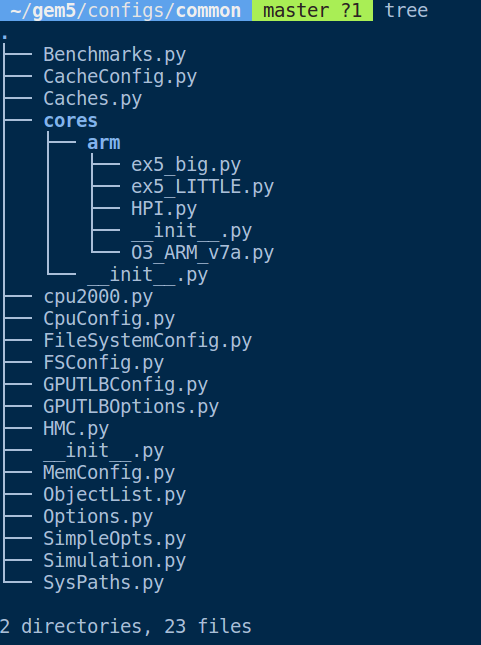
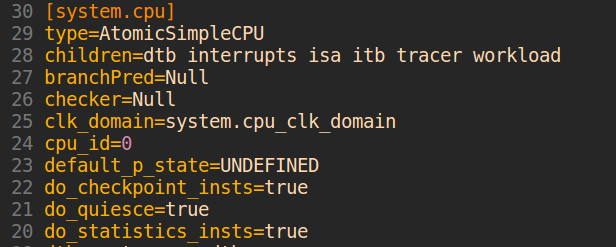

# Part1. Understanding gem5 statics and output


* config.ini

这个文件中包含了所有这个simulation中所有的SimObject以及他的参数


* config.json

这个文件和config.ini的功能时一样的，只是他的格式是json

* stats.txt

这个文件包含了这个simulation中gem5的统计数据


# Part2. Using the default configuration scripts

这里主要是理解default configuration scripts

## Directory Structure and Functionality

所有gem5的configuration files都可以在configs/目录下找到。这个目录的内容如下所示


每个目录的功能为

* boot/


> 这个目录里面是在full-system模式下的rcS文件(在<a href=" https://github.com/miaochenlu/LearningGem5/blob/master/lecs/Lec1_SimpleArchitecture/note.md ">Lec1</a>中有提到full-system mode和syscall emulation mode的区别)
>
> 这些文件在Linux boot后被simulator加载，并且被shell执行。大多数文件是在full-system模式下用来控制benchmark的

* common/



> 这个目录包含了创建仿真系统的helper scripts和functions
>
> * Options.py: 包含了可以在命令行设置的很多选项。比如CPU的数量
> * CacheConfig.py: 包含了设置cache参数的options和functions
> * MemConfig.py: 包含了设置memory system的helper functions
> * FSConfig.py: 包含了set up full-system仿真的必需函数
> * Simulation.py: 包含了很多set up和运行gem5的helper functions

* dram/

> 包含了测试DRAM的scripts

* example/

> 包含了一些gem5 configuration scripts示例

* ruby/

> 包含了Ruby的configuration scripts并且囊括了cache coherence protocols

* splash2/

> 包含了跑splash2 benchmark suite的scripts

* topologies/

> 包含了创建Ruby cache hierarchy时可以被用到的togologies的实现

## Use `se.py` and `fs.py`

不带options运行`se.py`


如下图所示，默认情况下gem5用atomic CPU和atomic memory accesses, 所以它并不报告real timing data




为了在timing mode下跑gem5, 我们需要specify CPU type, 我们也可以规定L1 cache的大小

```shell
build/X86/gem5.opt configs/example/se.py --cmd=tests/test-progs/hello/bin/x86/linux/hello --cpu-type=TimingSimpleCPU --l1d_size=64kB --l1i_size=16kB
```


我们到config.ini中查找cache的信息，会发现没有cache。其实虽然我们指定了l1 cache的大小，但是并没有创建cache

```shell
build/X86/gem5.opt configs/example/se.py --cmd=tests/test-progs/hello/bin/x86/linux/hello --cpu-type=TimingSimpleCPU --l1d_size=64kB --l1i_size=16kB --caches
```


这时在config.ini中才找到了cache的信息， 也可以发现时间从454507000降到了31680000


## Some common options

- `--cpu-type=PU_TYPE`

  The type of cpu to run with. This is an important parameter to always set. The default is atomic, which doesn’t perform a timing simulation.

- `--sys-clock=SYS_CLOCK`

  Top-level clock for blocks running at system speed.

- `--cpu-clock=CPU_CLOCK`

  Clock for blocks running at CPU speed. This is separate from the system clock above.

- `--mem-type=MEM_TYPE`

  Type of memory to use. Options include different DDR memories, and the ruby memory controller.

- `--caches`

  Perform the simulation with classic caches.

- `--l2cache`

  Perform the simulation with an L2 cache, if using classic caches.

- `--ruby`

  Use Ruby instead of the classic caches as the cache system simulation.

- `-m TICKS, --abs-max-tick=TICKS`

  Run to absolute simulated tick specified including ticks from a restored checkpoint. This is useful if you only want simulate for a certain amount of simulated time.

- `-I MAXINSTS, --maxinsts=MAXINSTS`

  Total number of instructions to simulate (default: run forever). This is useful if you want to stop simulation after a certain number of instructions has been executed.

- `-c CMD, --cmd=CMD`

  The binary to run in syscall emulation mode.

- `-o OPTIONS, --options=OPTIONS`

  The options to pass to the binary, use ” ” around the entire string. This is useful when you are running a command which takes options. You can pass both arguments and options (e.g., –whatever) through this variable.

- `--output=OUTPUT`

  Redirect stdout to a file. This is useful if you want to redirect the output of the simulated application to a file instead of printing to the screen. Note: to redirect gem5 output, you have to pass a parameter *before* the configuration script.

- `--errout=ERROUT`

  Redirect stderr to a file. Similar to above.

