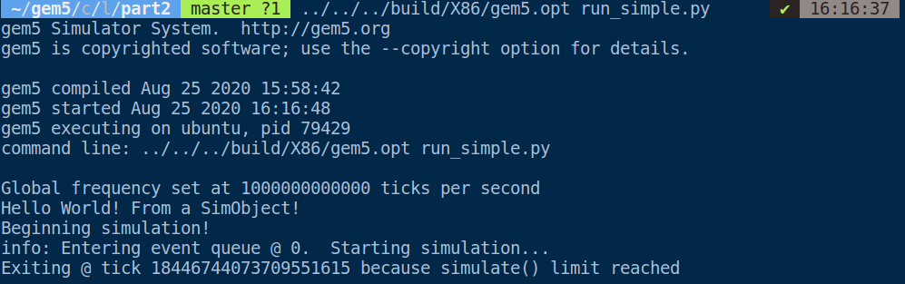
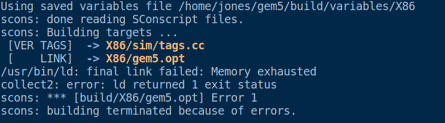
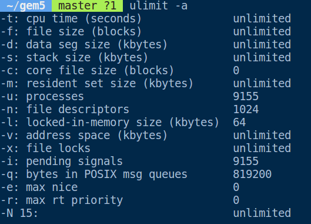

这节我们的任务时创建一个SimObject

## Step1

为新的SimObject创建一个python class。

每个SimObject都有一个关联的python class。这个类表明了可以通过python configuration files控制的参数。

我们创建要给HelloObject

```python
from m5.params import *
from m5.SimObject import SimObject 

class HelloObject(SimObject):
    type = 'HelloObject'
    cxx_header = "learning_gem5/hello_object.hh"
```

`type`并不一定要和类名相同，但是约定俗成是这样。`type`是你在用python SimObject包装的C++ class。

`cxx_header`是包含了type这个类的声明的文件


## Step2

用C++实现我们的SimObject

`hello_object.hh`

```python

#ifndef __LEARNING_GEM5_HELLO_OBJECT_HH__
#define __LEARNING_GEM5_HELLO_OBJECT_HH__

#include <string>

#include "params/HelloObject.hh"
#include "sim/sim_object.hh"

class HelloObject : public SimObject
{
  public:
    HelloObject(HelloObjectParams *p);
};

#endif // __LEARNING_GEM5_HELLO_OBJECT_HH__
```

`hello_object.cc`

```python

#include "learning_gem5/part2/hello_object.hh"
#include <iostream>

HelloObject::HelloObject(HelloObjectParams *params) :
    SimObject(params)
{
    std::cout << "Hello World! From a SimObject!" << std::endl;
}


HelloObject* HelloObjectParams::create()
{
    return new HelloObject(this);
}
```

## Step3

创建`SConscript`

```python
Import('*')

SimObject('HelloObject.py')
Source('hello_object.cc')
```

## Step4

重新build gem5

```shell
scons build/X86/gem5.opt
```

## Step5 

写个程序试试？

```python
# import the m5 (gem5) library created when gem5 is built
import m5
# import all of the SimObjects
from m5.objects import *

# set up the root SimObject and start the simulation
root = Root(full_system = False)

# Create an instantiation of the simobject you created
root.hello = HelloObject()

# instantiate all of the objects we've created above
m5.instantiate()

print("Beginning simulation!")
exit_event = m5.simulate()
print('Exiting @ tick %i because %s' % (m5.curTick(), exit_event.getCause()))
```

这个代码我没写，听说结果是这样



## Error Error Error

编译的时候遇到了bug: memory exhausted



发现了一个指令可以设置参数



然而我把stack size设置为unlimited依然报错。最后将虚拟机内存从2G改成了3G才解决了这个问题。