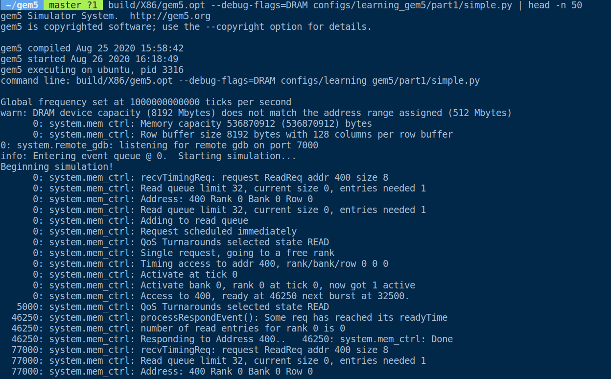

这节的任务是Debugging gem5

## Using debug flags

#### `DRAM` debug

```shell
build/X86/gem5.opt --debug-flags=DRAM configs/learning_gem5/part1/simple.py | head -n 50
```




#### `Exec` debug


#### Debug flags


## Add Debug Flags

在之前增加HelloObject的代码中，我们简单的用了`std::cout`来输出。这里我们用debugging facilities

### Setp1

在创建要给新的debug flag时，首先我们需要在Sconscript文件中声明

```shell
DebugFlag('Hello')
```

这样我们就声明了一个"Hello"的debug flag

### Step2

声明了flag之后，会自动生成debug header, 这个header file在debug目录里面，并且和Sconscript中声明的名字相同。

在`hello_object.cc`中

```cpp
#include "debug/Hello.hh"
```

### Step3

用`DPRINTF`来代替`std::cout`

```cpp
DPRINTF(Hello, "Created the hello object\n");
```

注意: `DPRINTF`时一个C++ macro, 第一个参数是debug flag, 第二个参数为传递给printf的参数


运行结果时这样， 不过代码和上面有些不相同的地方


